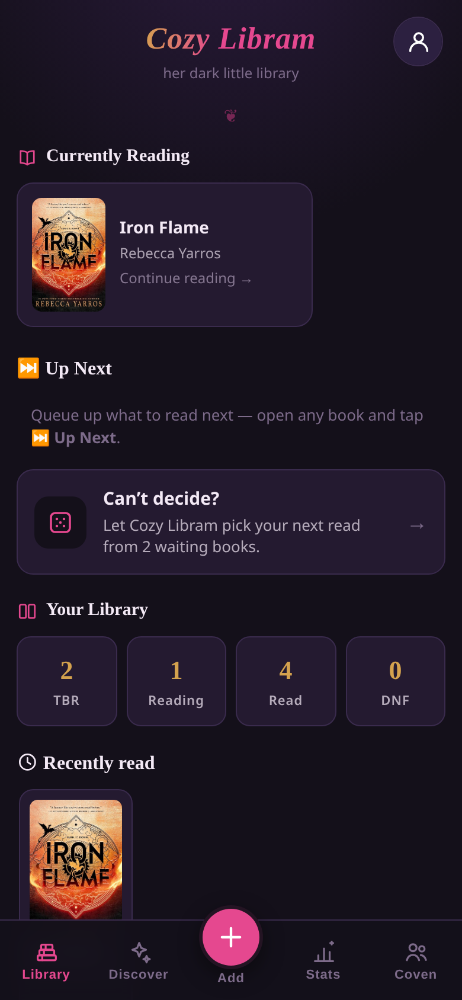
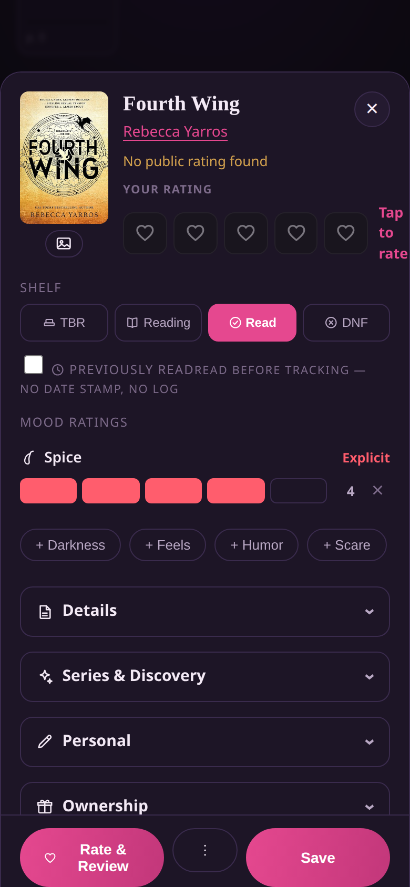
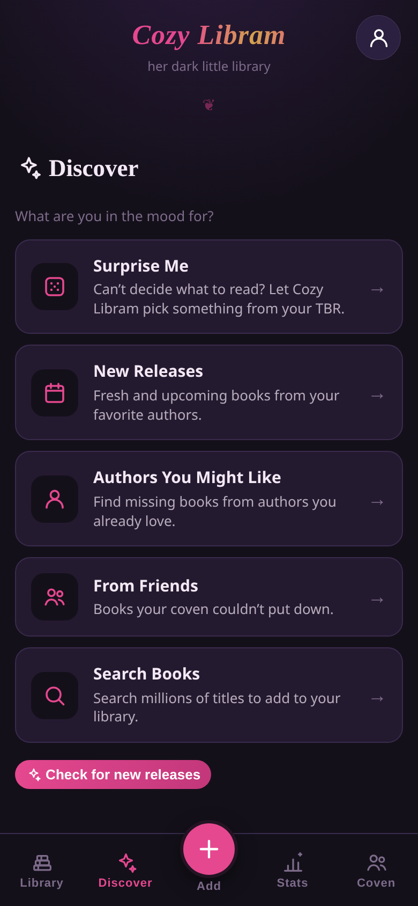
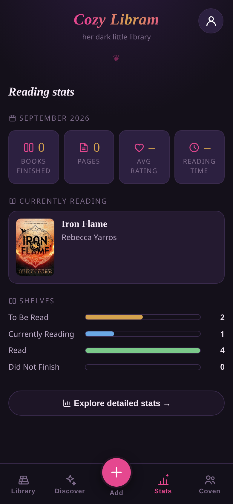

# Cozy Libram 📚

A mobile-first, installable web app (PWA) for tracking a book collection —
built for a prolific dark-romance reader, now the household's shared
library. The library lives on-device in `localStorage` (fully offline);
optional Supabase login adds per-user cloud backup, multi-device sync,
and social shelves.



## What it does

**Add books, three taps or less**
- 📷 Barcode scan with the phone camera (native `BarcodeDetector`,
  Quagga2 fallback, manual ISBN as backup)
- 🔍 Title/author search across Google Books, Open Library, and Hardcover
- ⌨️ Bulk ISBN import — paste a stack, paced lookup, one-tap add
- 📥 Import hub: Goodreads CSV, StoryGraph CSV, ISBN lists, Bookmory
  backups (parsed in-browser, no server), Hardcover CSV exports

**Shelves & personal layer**
- Shelves: To Be Read · Currently Reading · Read · Did Not Finish, plus
  a Favorites bookshelf and a Wishlist with region-aware storefront links
  and coming-soon countdowns
- Personal ♥ rating (1–5) and genre-aware intensity axes — 🌶️ Spice for
  romance, 👻 Scare for horror, 😰 Suspense for thrillers, ⚔️ Adventure
  for fantasy/sci-fi — auto-detected per book, 1–5 each
- Trope tags, page tracking with a daily reading log, calendar, streaks,
  notes, and saved quotes
- Hardcover enrichment in the background: series name + position,
  content warnings, mood chips, extra genres, and a blended community
  rating (ISBN-verified)



**Discovery**
- **Discover tab**: new releases from your top authors (checked
  automatically weekly), "More like this" strips, series collections
  with "owns X of Y" progress badges and missing-in-series lookup
- **Authors tab** with missing-by-author lookup
- 🎲 **TBR Roulette**: set your mood — genre, tropes, minimum spice —
  and spin; slot-machine animation lands a winner with one-tap
  **Start reading**

**Stats**
- Dashboard: books finished, pages devoured, average rating, shelf
  distribution, top tropes, current-read progress — plus a detailed
  stats explorer

 

**Coven (private social)**
- Invite-code friends, read-only shelf browsing, per-shelf privacy
  controls ("share my shelves" + hide individual shelves)
- "You'd love this" recommendations from friends' 4★+ books
- Soulmate scores, monthly leaderboard, buddy reads, now-reading feed

**Sync & safety**
- Supabase cloud sync: pull-merge-push with last-write-wins conflict
  resolution, deletion tombstones (a deleted book stays deleted),
  per-user on-device partitions, realtime updates across devices
- Quiet by design: background syncs pulse a small dot instead of
  toasting; manual syncs report what changed

**Feel**
- 8 accent themes, cohesive line-art icon set, 3-step onboarding,
  thoughtful empty states, full PWA (installable, offline covers)

## Run it locally

No build step, no dependencies — it's static files.

```bash
cd booktok
python3 server.py        # serves on http://localhost:8000
```

On Windows, double-click `start-server.bat`. On the same Wi-Fi, open
`http://<your-PC's-IP>:8000` on a phone (camera barcode scanning needs
HTTPS or localhost — over plain HTTP use the photo/scan fallback or
title search).

## API keys (server-side)

Metadata providers need keys, and they never touch the browser:

- **Local**: copy `server-config.example.json` → `server-config.json`
  and fill in `HARDCOVER_TOKEN` + `GOOGLE_BOOKS_KEY`. `server.py`
  serves `/config.js` from it and proxies `/api/*` with the keys
  attached server-side. Never commit `server-config.json`.
- **Cloudflare Pages** (production: https://cozylibram.pages.dev):
  set `HARDCOVER_TOKEN`, `GOOGLE_BOOKS_KEY`, `SUPABASE_URL`,
  `SUPABASE_ANON_KEY` as environment variables. `functions/api/*`
  attach the secrets server-side; `/config.js` carries only capability
  flags plus the public Supabase anon key.

If a token was ever pasted anywhere public (chat logs, screenshots),
revoke it at hardcover.app and make a fresh one.

## Optional: Supabase cloud sync

See `supabase/README.md`. Tables: `books`, `deleted_books`, `profiles`
(per-user RLS), `circle_links`/`circle_invites` (Coven),
`analytics_events` + `app_admins` (first-party analytics, default-on
for signed-in users with a Settings → Privacy opt-out).

## Tech notes

- Single-page vanilla JS — numbered classic scripts (`js/000-core.js`
  … `js/200-boot.js`), zero runtime dependencies, no build step.
- Book schema: `id, isbn, title, authors[], cover, description,
  pageCount, publishedDate, categories[], publicRating, ratingsCount,
  status, ratings{spice|scare|suspense|adventure}, myRating, tropes[],
  tropesAuto[], axes[], progress, log[], quotes[], notes, series{},
  contentWarnings[], moods[], owned, favorite`, plus sync (`_mtime`)
  and enrichment (`hcEnriched`) bookkeeping.
- Service worker precaches the app; bump `APP_VERSION` to force a
  full asset refetch.
- Test suite in `.test/` (`npm test`) — one feature per version,
  tests green + committed + pushed is the definition of done.

## Roadmap

See [ROADMAP.md](ROADMAP.md) — currently two pillars: a **trope
intelligence** layer (curated multi-genre trope taxonomy, LLM-seeded
per-book tropes, community refinement) and **sustained quality**.
The implementation plan lives in
[TROPE_INTELLIGENCE_PLAN.md](TROPE_INTELLIGENCE_PLAN.md).
